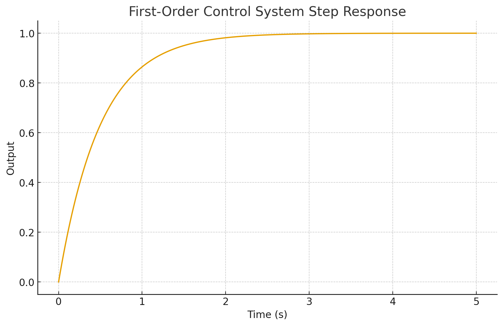

# Control System Response

## Introduction
This project simulates the step response of a **first-order control system** using Python and SciPy.  
The system is modeled as a transfer function:

G(s) = K / (τs + 1)

where **K** is the system gain and **τ** is the time constant.

## Files
- `control_system_response.py`: Main script containing the simulation.  
- `requirements.txt`: Dependencies (`numpy`, `matplotlib`, `scipy`).  
- `control_demo_step_response.png`: Example output plot generated after running the script.  

## Example Output


## Quick Start
1. Install dependencies:
```bash
pip install -r requirements.txt
```

2. Run the script:
```bash
python control_system_response.py
```

This will display the step response and save it as `control_demo_step_response.png`.

## Notes
- You can adjust **K** (gain), **τ** (time constant), and simulation duration in the script.  
- This project illustrates fundamental control theory concepts and simulation using Python.
